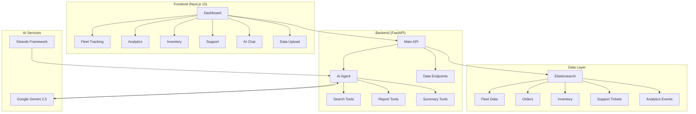
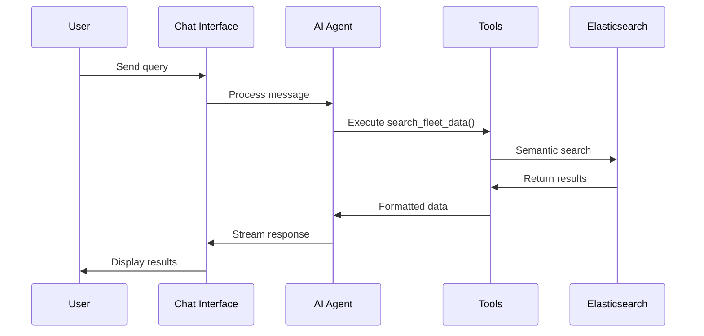
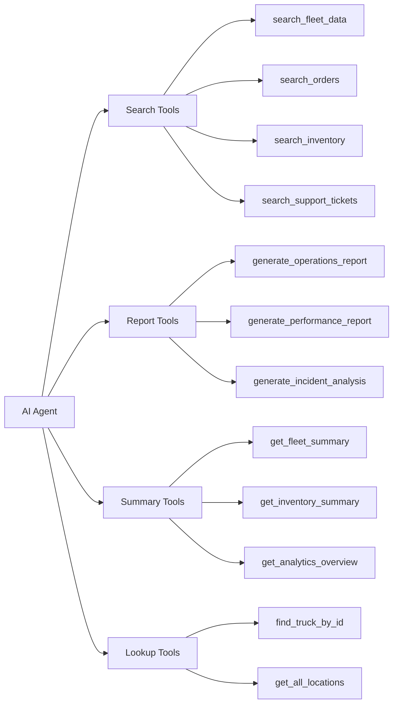
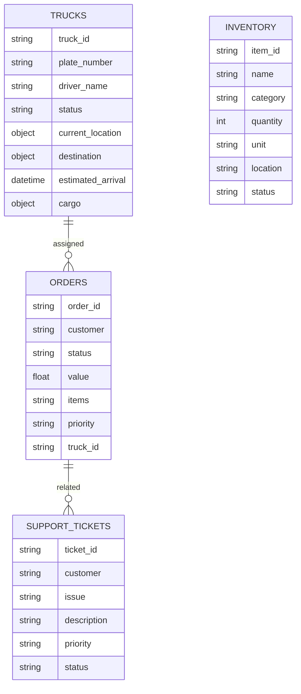

# Runsheet

<div align="center">

[](https://strandsagents.com)
[](https://cloud.google.com/vertex-ai)
[](https://www.elastic.co/)
[](https://nextjs.org/)
[](https://fastapi.tiangolo.com/)
[](https://www.typescriptlang.org/)
[](https://cloud.google.com/)

**AI-powered logistics monitoring system with real-time fleet tracking, inventory management, and intelligent analytics.**

</div>

## Architecture



## Components

### Frontend Structure
```
runsheet/
├── src/
│   ├── app/
│   │   ├── page.tsx           # Main dashboard
│   │   └── signin/page.tsx    # Authentication
│   ├── components/
│   │   ├── AIChat.tsx         # AI assistant
│   │   ├── FleetTracking.tsx  # Fleet management
│   │   ├── Analytics.tsx      # Performance metrics
│   │   ├── MapView.tsx        # Google Maps
│   │   ├── Inventory.tsx      # Stock management
│   │   ├── Orders.tsx         # Order tracking
│   │   └── Support.tsx        # Ticket system
│   ├── services/
│   │   ├── api.ts            # Backend API
│   │   └── mockData.ts       # Test data
│   └── types/
│       └── api.ts            # TypeScript types
```

### Backend Structure
```
Runsheet-backend/
├── main.py                    # FastAPI server
├── Agents/
│   ├── mainagent.py          # AI agent controller
│   └── tools/
│       ├── search_tools.py   # Data search
│       ├── report_tools.py   # Report generation
│       ├── lookup_tools.py   # Data lookup
│       └── summary_tools.py  # Data summaries
├── services/
│   ├── elasticsearch_service.py  # Database layer
│   └── data_seeder.py        # Data management
└── demo-data/                # Sample CSV files
```

### AI Agent Flow



## Technology Stack

**Frontend**
- Next.js 15 (React App Router)
- TypeScript
- Tailwind CSS
- React Google Maps
- Lucide React icons
- React Markdown

**Backend**
- FastAPI (Python)
- Strands AI Framework
- Google Gemini 2.5 Flash
- Elasticsearch
- Python 3.11+

**Infrastructure**
- Elasticsearch Cloud
- Google Cloud Platform
- CORS middleware
- Server-sent events

## Setup

### Prerequisites
- Node.js 18+
- Python 3.11+
- Elasticsearch Cloud account
- Google Cloud Platform account

### Backend

```bash
cd Runsheet-backend
python -m venv venv
source venv/bin/activate  # Windows: venv\Scripts\activate
pip install -r requirements.txt
```

Create `.env` file:
```
ELASTIC_API_KEY=your_elasticsearch_api_key
ELASTIC_ENDPOINT=your_elasticsearch_endpoint
GOOGLE_CLOUD_PROJECT=your_gcp_project_id
```

Setup Google Cloud credentials:
- Place service account JSON in backend directory
- Update path in `mainagent.py`

Start server:
```bash
python main.py
```

### Frontend

```bash
cd runsheet
npm install
npm run dev
```

The system auto-seeds baseline data on startup. Upload additional data via the Data Upload interface using CSV files from `demo-data/`.

## Usage

### AI Assistant

The system supports natural language queries:

```
"Show me all delayed trucks"
"Find trucks carrying network equipment"
"Search for high priority orders"
"Check diesel fuel levels"
"Generate a performance report"
```

### Available Tools



## Data Models

### Elasticsearch Indices



### API Endpoints

```
GET  /api/fleet/trucks          # List all trucks
GET  /api/fleet/summary         # Fleet statistics
GET  /api/orders               # List orders
GET  /api/inventory            # List inventory
GET  /api/support              # List support tickets
POST /api/chat                 # AI assistant
POST /api/upload/csv           # Upload data
```

## Configuration

### Environment Variables

```bash
# Elasticsearch
ELASTIC_API_KEY=your_api_key
ELASTIC_ENDPOINT=https://your-cluster.es.region.aws.found.io

# Google Cloud
GOOGLE_CLOUD_PROJECT=your_project_id
GOOGLE_APPLICATION_CREDENTIALS=path/to/service-account.json
```

### AI Agent Configuration

The AI agent uses the Strands framework with Google Gemini 2.5 Flash. Tools are automatically registered and available for natural language queries.

## Development

### Running Tests
```bash
# Backend
cd Runsheet-backend
python -m pytest

# Frontend
cd runsheet
npm test
```

### Building for Production
```bash
# Frontend
npm run build

# Backend
pip install gunicorn
gunicorn main:app
```